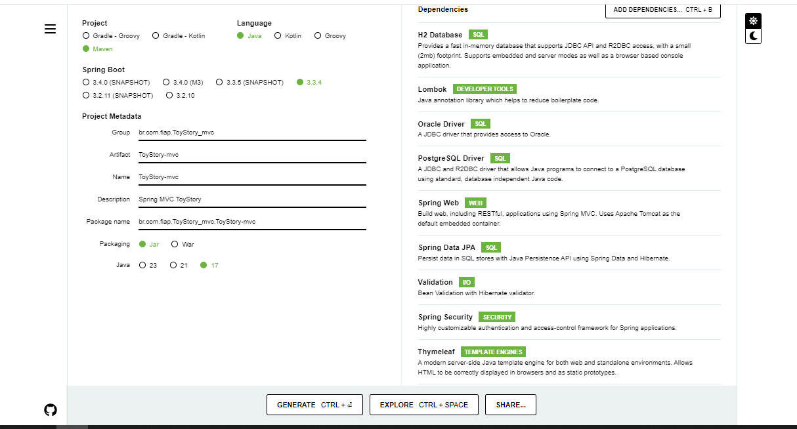
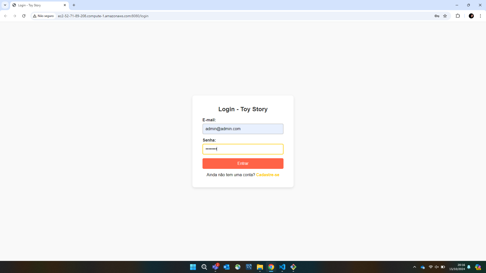
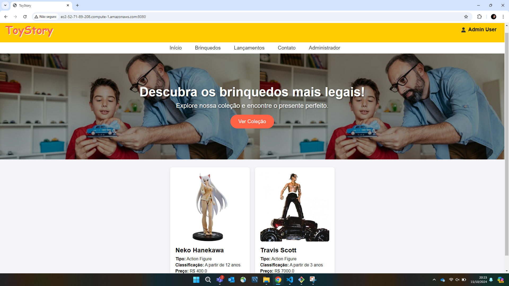
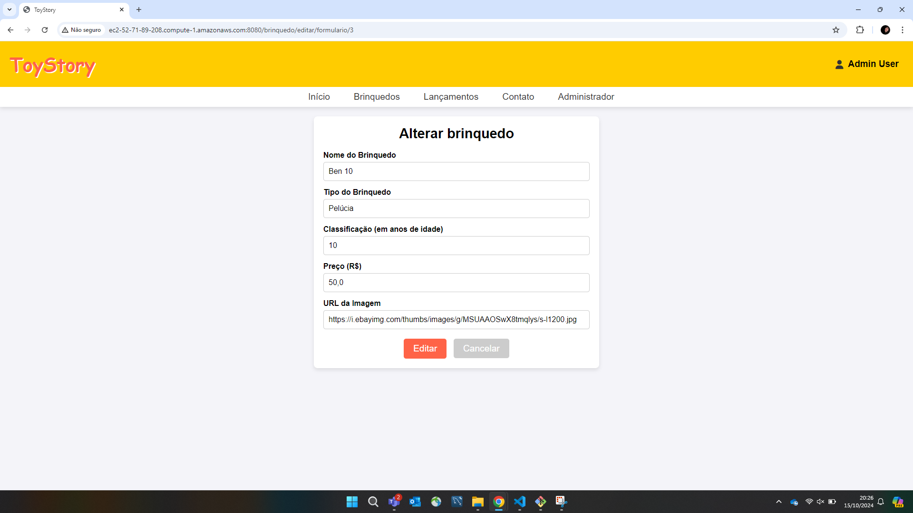
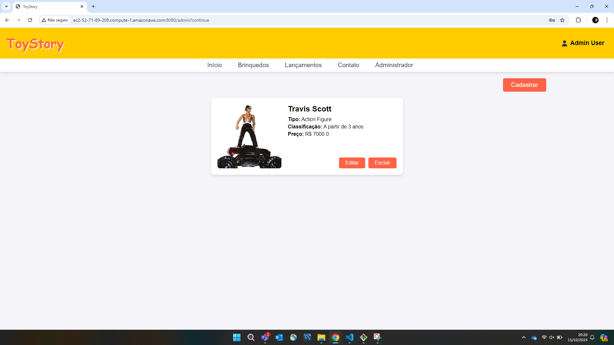

## Deploy

[Link do Deploy - AWS](http://ec2-52-71-89-208.compute-1.amazonaws.com:8080/)

O Deploy foi feito utilizando o serviço “EC2" da Amazon Web Services (AWS).

# Spring Initializer




## Telas

# Loja de Brinquedos - Spring MVC Application

## Descrição do Projeto

Esta é uma aplicação de uma **Loja de Brinquedos** desenvolvida utilizando **Spring MVC**. A aplicação permite que usuários e administradores interajam com o sistema de acordo com seus papéis, fornecendo funcionalidades de autenticação e autorização. 

- **Usuário comum**: pode se cadastrar e verificar últimos lançamentos e suas compras.
- **Administrador**: possui acesso a um CRUD completo para gerenciar os brinquedos disponíveis na loja.

O projeto foi implementado utilizando **IntelliJ IDEA** como IDE principal, e o desenvolvimento é totalmente containerizado com **Docker**. O banco de dados utilizado é o **PostgreSQL**, que é orquestrado por um arquivo **docker-compose** para facilitar o setup e deploy.

## Tecnologias Utilizadas

- **Spring MVC**: Framework Java para o desenvolvimento do backend.
- **PostgreSQL**: Banco de dados relacional.
- **Docker**: Para containerizar a aplicação e o banco de dados.
- **Docker Compose**: Para orquestrar o ambiente de desenvolvimento com um banco de dados PostgreSQL e a aplicação Java.
- **AWS**: Plataforma de deploy da aplicação.
- **IntelliJ IDEA**: IDE utilizada no desenvolvimento do projeto.

## Funcionalidades

### Usuário Comum
- Cadastro de novos usuários através da tela de login.
- Consulta de brinquedos disponíveis na loja.

### Administrador
- CRUD completo para o gerenciamento dos brinquedos (inclusão, edição, remoção e listagem).

### Autenticação e Autorização
- Implementação de autenticação via **Spring Security**.
- Dois perfis de usuário: **admin** e **user**.
- Conta admin inicial gerada automaticamente no sistema:
  - **Email**: `admin@admin.com`
  - **Senha**: `admin123`

  Usuários com perfil de "user" podem ser criados diretamente na tela de cadastro.

## Tela de Login

A tela de login foi desenvolvida para ser simples e intuitiva. Ela permite que novos usuários se cadastrem e façam login no sistema. O layout é responsivo e se adapta bem em diferentes tamanhos de tela.



Ao acessar o sistema com as credenciais do administrador, o usuário é redirecionado para a landing page - home.




O usuário admin também possui acesso a seção de administração, onde pode realizar CRUD dos brin quedos.



O usuário como pode, ainda, visualizar os novos lançamentos.




## Estrutura do Projeto

O projeto foi estruturado utilizando o padrão MVC (Model-View-Controller):

- **Model**: Contém as entidades do banco de dados e regras de negócio.
- **View**: Arquivos **Thymeleaf** para renderização do front-end.
- **Controller**: Responsável pelo gerenciamento das requisições e interações com o front-end e o modelo.

### Estrutura de Diretórios

```bash
.
+---.mvn
│   docker-compose.yml
│   Dockerfile
│   mvnw
│   mvnw.cmd
│   pom.xml
│   README.md
|   \---wrapper
+---screens
\---src
    +---main
    |   +---java
    |   |   \---br
    |   |       \---com
    |   |           \---fiap
    |   |               \---ToyStory_mvc
    |   |                   +---config
    |   |                   +---controller
    |   |                   +---dto
    |   |                   +---model
    |   |                   +---repository
    |   |                   +---service
    |   |                   \---utils
    |   \---resources
    |       \---templates
    |           +---brinquedo
    |           +---compras
    |           \---usuario
    \---test
        \---java
            \---br
                \---com
                    \---fiap
                        \---ToyStory_mvc
